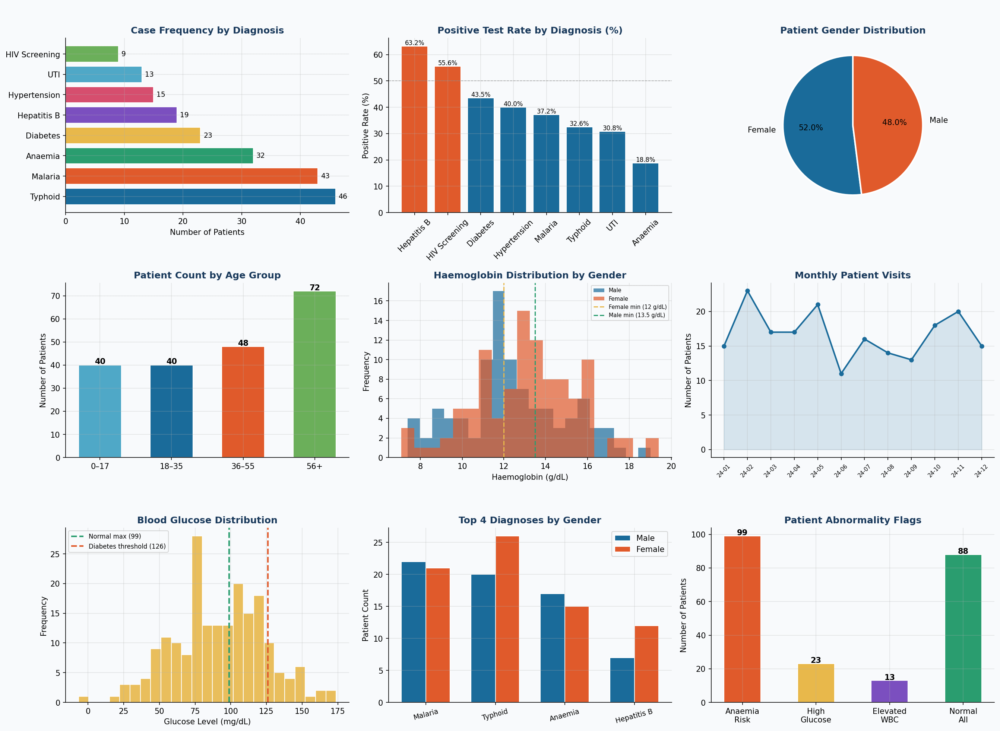

# Medical-Diagnostic-Analysis-Python
## Project Overview

This project analyzes diagnostic test records from a health center covering January–December 2024. Using Python, I cleaned and explored the data to identify disease patterns, lab abnormalities, and patient demographics, turning raw clinical data into actionable health insights.

---

## Dataset Description

**200 patient records** with the following fields:

| Column | Description |
|---|---|
| patient_id | Unique patient identifier |
| age / age_group | Patient age and grouped category |
| gender | Male / Female |
| diagnosis | Clinical diagnosis |
| test_result | Positive / Negative |
| wbc_count | White Blood Cell count (×10³/µL) |
| rbc_count | Red Blood Cell count (×10⁶/µL) |
| haemoglobin | Haemoglobin level (g/dL) |
| glucose | Blood glucose level (mg/dL) |
| visit_date | Date of clinic visit |

---

## Dashboard Preview



---

## Visualizations — Detailed Explanations

### Chart 1: Case Frequency by Diagnosis
This horizontal bar chart shows how many patients were diagnosed with each condition during the year. Typhoid and Malaria had the highest case counts, making them the most prevalent diseases in this dataset. This helps the health center prioritize resources and stock the right medications.

---

### Chart 2: Positive Test Rate by Diagnosis (%)
This chart shows the percentage of patients who tested **positive** for each diagnosis. Hepatitis B had the highest positive rate at 63.2%, followed by HIV Screening at 55.6%. A high positive rate means the disease is more likely to be confirmed when a patient is tested — signaling where early screening and intervention are most critical.

---

### Chart 3: Patient Gender Distribution
This pie chart breaks down the patient population by gender. Females made up 52% of visits and males 48%, showing a fairly balanced patient base. Understanding gender distribution helps clinicians tailor health campaigns and identify if certain conditions are more gender-specific.

---

### Chart 4: Patient Count by Age Group
This bar chart groups patients into four age brackets: 0–17, 18–35, 36–55, and 56+. The 56+ age group had the highest visit count, suggesting older patients require more frequent diagnostic testing. This finding supports the need for dedicated elderly care programmes at the health center.

---

### Chart 5: Haemoglobin Distribution by Gender
This histogram compares haemoglobin levels for male and female patients side by side, with reference lines showing the clinical thresholds (12.0 g/dL for females, 13.5 g/dL for males). Patients below these lines are at risk of anaemia. The chart reveals that a significant portion of both genders fell below the normal range, indicating anaemia is a widespread concern.

---

### Chart 6: Monthly Patient Visits
This line chart tracks how many patients visited the health center each month across 2024. It reveals seasonal patterns, higher visits in certain months may correlate with disease outbreaks (e.g. malaria during rainy season). This information is useful for planning staffing levels and medical supply orders.

---

### Chart 7: Blood Glucose Distribution
This histogram shows the spread of fasting blood glucose levels across all patients. Two reference lines are marked: 99 mg/dL (upper limit of normal) and 126 mg/dL (diabetes diagnosis threshold). Patients to the right of 126 mg/dL are flagged as high-risk. The chart shows that 11.5% of patients exceeded this threshold, suggesting an undiagnosed diabetes burden in the population.

---

### Chart 8: Top 4 Diagnoses by Gender
This grouped bar chart compares how Malaria, Typhoid, Anaemia, and Hepatitis B affect male and female patients differently. Typhoid was slightly more common in females while Anaemia was nearly equal across genders. This breakdown helps design gender-targeted health interventions.

---

### Chart 9: Patient Abnormality Flags Summary
This summary bar chart counts how many patients were flagged for three key clinical abnormalities: low haemoglobin (anaemia risk), high blood glucose (diabetes risk), and elevated WBC (possible infection). Nearly half of all patients showed at least one abnormality, highlighting the importance of routine full blood count testing even for patients visiting for unrelated reasons.

---

## Key Findings

| Finding | Detail |
|---|---|
| Most common diagnosis | Typhoid (46 cases) |
| Highest positive test rate | Hepatitis B (63.2%) |
| Anaemia risk patients | 99 patients (49.5%) |
| High glucose patients | 23 patients (11.5%) |
| Most affected age group | 56+ years |
| Peak diagnosis | Typhoid & Malaria combined = 44.5% of all cases |

---

## Recommendations

1. **Malaria & Typhoid** — reinforce preventive outreach and water sanitation campaigns, especially in Q2/Q3
2. **56+ age group** — introduce mandatory routine screening programmes for this high-visit group
3. **Anaemia** — integrate iron and nutrition counselling into all diagnosis pathways given the 49.5% risk rate
4. **Glucose screening** — expand pre-diabetes testing for patients over 36, not just those presenting with diabetes symptoms
5. **Hepatitis B** — consider routine Hepatitis B vaccination drives given the 63.2% positive rate

---

## How to Run

```bash
# Install dependencies
pip install pandas numpy matplotlib

# Run the script
python medical_analysis.py
```

---

## Tools Used
- **Python 3.x**
- **Pandas** — data manipulation, grouping, and aggregation
- **NumPy** — numerical operations and abnormality flagging
- **Matplotlib** — all 9 visualizations
